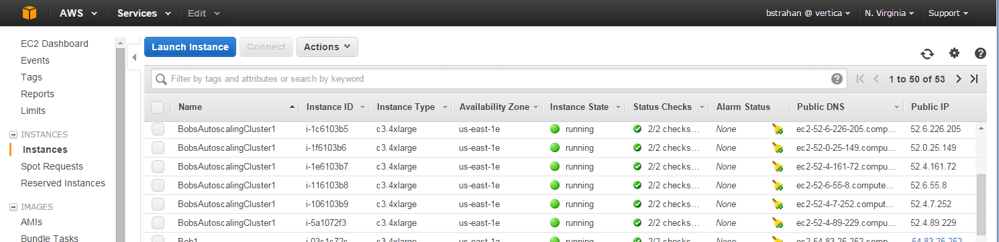
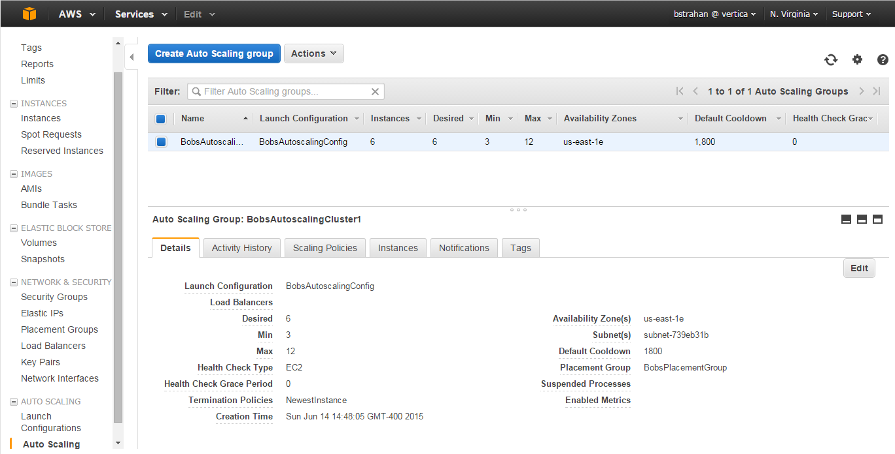

#Automatic Vertica Scaling and Node Replacement on AWS

If you are using AWS (or are considering using AWS) to host your Vertica cluster, then you may wonder if the AWS Auto Scaling service will work with a Vertica cluster. Well, wonder no more - the answer is 'yes'.

Our new Vertica AWS Auto Scaling package makes it easy. Here are some of the features:
- Provision a new Vertica cluster with the number of nodes you want
- Add horsepower by making your cluster bigger
- Save money by making your cluster smaller
- Keep your cluster resilient by automatically replacing failed nodes with new nodes (no need to pay for active standby nodes)
- Subscribe to receive notifications when nodes are added or removed

The Vertica Auto Scaling package is provided to you free of charge (and also free of any warranty or liability). If you like it you can use it as it is, or you can make it better, and contribute it back to the Vertica community.  

As you read through the sections below, you will learn how it all works, and you'll be able to try it for yourself.

Ready to get started?

## Architectural overview

An auto scaling group controls the creation and termination of all EC2 instances used as Vertica cluster nodes. The instance count is established, and maintained, based on the configured 'desired' size of the group. (The EC2 images are built using the Vertica 7.1.1 Amazon Machine Image (AMI) - so the Vertica software package is pre-installed)

The Vertica Auto Scaling package provides the smarts for the AWS Auto Scaling service to integrate with Vertica, to a) make a cluster bigger, b) make a cluster smaller, c) replace one or more DOWN nodes.


Here's how it works.

- To get started, we launch a new auto scaling group with just one node, on which we create a bootstrap cluster and database.

- Expand the desired size of the group to prompt auto scaling to launch new EC2 instances. Each new node will run a custom launch script allowing it to join the cluster by conecting via vsql to the database running on an existing node in the group, and invoking a script via a Vertica external procedure call.
 
- If the desired group size is decreased, auto scaling will terminate as many EC2 instances as necessary to reduce the group to the new desired size. The auto scaling 'lifecycle hook' mechanism publishes an SQS message, which gives the running nodes an opportunity to automatically run the necessary scripts to remove the terminating nodes and rebalance the cluster before the instances go offline. 

- Each node can detect when any database node has been DOWN for more than a configurable timeout threshold, and instruct AWS to terminate the EC2 instance associated with the DOWN node. Auto Scaling will then attempt to launch a new instance to replace  the terminated instance.  The new instance checks (via its launch script) to see if there are any DOWN nodes before it tries to join the cluster, and, if so, it will 'adopt' the Private IP Address of the down node and join the cluster masquarading as the node which failed, initiate node recovery, and so restore the cluster to health.


## Setup

- **Download the Vertica Auto Scaling package from github**  
`git clone https://github.com/rstrahan/aws-autoscaling-vertica.git`

- **Create the config file**  
Copy the template, `autoscaling_vars.sh.template`, to `autoscaling_vars.sh`, and edit to provide valid settings for each variable (see Appendix).
When you are done editing, check the configuration with `./validate_config.sh`

- **Make the instance userdata launch script**  
Run `./makeLaunchScript.sh` to create `launch.sh` from the template and the config settings entered in the previous step.
The launch.sh script will be run by each new EC2 instance on its first startup.

- **Install and configure the AWS client**  
Run `./installAWSClient.sh` to download, install, and configure the AWS command line interface using the AWS account information you put in autoscaling_vars.sh.

## Auto Scaling in Action

### 1. Create a new Vertica cluster from scratch

Three simple steps:
```
# create autoscaling group with 1 instance
./setup_autoscaling.sh

# install Vertica 1-node cluster and set up database
./bootstrap.sh

# expand cluster to desired size (per config file)
./scale_cluster.sh
Configuring Autoscaling Group: BobsAutoscalingCluster1
Setting
 - min instances:       3
 - max instances:       9
 - desired instances:   3
Done
```
After a few minutes your cluster will be ready. Now you can import it to your Vertica Management Console, create users, load data, hook up your application, etc.

To list the public and private IP addresses for each node in your cluster, use the handy `cluster_ip_addresses.sh` script.

Connect using ssh as dbadmin user to the public address of any node using your certificate (pem) file: `ssh -i <pem> dbadmin@<publicIp>`. Once securely logged in to any cluster node you can connect locally to the database as dbadmin, without a password.

You can also connect to the database from outside the cluster using vsql or one of the supported client libraries. E.g. `vsql -h <publicIp> -U dbadmin -w <password>`.

Here's the Management Console view of our new (3-node) cluster.


###2. Make your cluster bigger

Edit the autoscaling_vars.sh file, and change the setting `desired` to a larger number (not greater than `max`).  
Then run `./scale_cluster.sh` to configure the new setting, and see your cluster grow! Here we set the desired size to 4 nodes:
```
$ ./scale_cluster.sh
Configuring Autoscaling Group: BobsAutoscalingCluster1
Setting
 - min instances:       3
 - max instances:       9
 - desired instances:   4
Done
```

You can query the table `autoscale.launches` to see the status as the new instances are added to the cluster, and then to the database.

Management Console will automatically detect and add the additional node(s) to its cluster/database view.


###3. Make your cluster smaller

Edit the autoscaling_vars.sh file, and change the setting `desired` to a smaller number (not smaller than `min`). Then run `./scale_cluster.sh` to configure the new group setting. Here we set the desired size back to 3 nodes:

```
$ ./scale_cluster.sh
Configuring Autoscaling Group: BobsAutoscalingCluster1
Setting
 - min instances:       3
 - max instances:       9
 - desired instances:   3
Done
```
You can query the table `autoscale.terminations` to see the updating status as the instances are removed from the database, and then from the cluster.

Management Console will automatically remove the terminated node(s) from its cluster/database view. Now the database looks just like it did when we started, with 3 nodes again.


###4. Replace a DOWN node

A DOWN node will be automatically terminated after a configurable timeout period, and  replaced by a new node which will be configured to adopt the privateIP address of the old one.

Here, we see a failed node highlighted DOWN in MC, with the remaining 2 nodes marked CRITICAL. 


After the timeout has elaspsed (the default is 5 minutes), the AWS EC2 instance for the DOWN node will be terminated by one of the other cluster nodes. This action is logged in the table `autoscale.downNodes`

The Auto Scaleing service will then launch a new instance to restore the cluster to the desired node count. You can query the table `autoscale.launches` to see the updating status as the new instance is added to replace the failed one.

When it has finished, the cluster is restored again to perfect health.


##Using the AWS Console

The EC2 instances associated with your auto scaling cluster can be seen from the AWS EC2 Console, identified by name tags showing the group name that you specified in the configuration.



You can also view, and even edit, the auto scaling group settings from the EC2 console. If you prefer, you can initiate scale up or scale down actions by changing the desired group from the console, instead of editing the config file and running scale_cluster.sh.



## Dynamic cluster scaling

AWS makes it possible to initiate auto scaling actions based on metrics from Cloudwatch, using [auto scaling policies](http://docs.aws.amazon.com/AutoScaling/latest/DeveloperGuide/policy_creating.html). By adding policies, you could, for example, configure your auto scaling group to add nodes to your cluster if, say, the average CPU utilization of the existing instances exceeded some threshold for some sustained time window, and to reduce the cluster size after the cooldown period, if the CPU utilization is stays under some lower threshold. This mechanism has the potential to provide true 'hands off' scaling. 

It's also possible to [schedule auto scaling changes](http://docs.aws.amazon.com/AutoScaling/latest/DeveloperGuide/schedule_time.html) via the AWS CLI. For example, if you know that you need a bigger cluster at certain times in your business cycle (e.g. end of month, end of quarter, during special events, etc.) you could schedule a cluster size increase in advance, and then scale down again when you no longer need the additional nodes. 

NOTE, every time nodes are added or removed, the cluster will be rebalanced automatically. Normal database operations can continue during rebalancing, although performance will be degraded until the rebalancing has completed. The Vertica 'Elastic Cluster' feature (with local segmentation) will be enabled by default; this helps to minimise the overhead of rebalancing under the right conditions. See Vertica docs on [Elastic Cluster](http://my.vertica.com/docs/7.1.x/HTML/index.htm#Authoring/AdministratorsGuide/ClusterManagement/ElasticCluster/ElasticCluster.htm%3FTocPath%3DAdministrator's%2520Guide%7CManaging%2520the%2520Database%7CManaging%2520Nodes%7CElastic%2520Cluster%7C_____0) to learn more about this feature and how to make best use of it.

## Placement Groups

By default, an AWS EC2 [Placement Group](http://docs.aws.amazon.com/AWSEC2/latest/UserGuide/placement-groups.html) will be created for you during setup. All instances in your auto scaling group will be launched within this placement group to maximimise the performance and reliability of your cluster, by providing the fastest and most reliable 10Gbps networking possible in AWS.

However, using a placement group makes it possible that an attempt to launch new instances may fail due to insufficient capacity. If that happens, the Auto Scaling service will notify you (via SNS) of a failed launch, and it will retry (and hopefully succeed) a little later.  

## Subscribing for SNS email notifications

After setting up the auto scaling group, go to the [AWS SNS console](https://console.aws.amazon.com/sns/v2/home), and select the topic that was created for your group (<GroupName>_Scale_Event). Use the Action menu to subscribe to the topic and specify your delivery method of choice.

## Troubleshooting

Use the following log files and database tables to montitor auto scaling activity and to troubleshoot problems.

- /var/log/launch.log
Captures stdout and stderr from launch.sh script, run on each node during its first startup. If it appears that an EC2 instance has started, but has failed to join the cluster, and there is no sign of it in the autoscale.launches table, you can ssh to the affected instance and check this log file for clues.

- ~dbadmin/autoscale/add_nodes.log
Captures stdout and stderr from add_nodes.sh, the script that is called remotely (via autoscale.add_nodes() external procedure) from each new instance as it starts up for the first time. The log file will be created on the node selected by the new instance, typically the first node in the cluster (the bootstrap node) if it is running. You can check the 'added_by_node' column in autoscale.launches to verify the node responsible for adding each instance.

- ~dbadmin/autoscale/down_node_check.log
Captures stdout and stderr from down_node_check.sh, a script that is run every 1 minute from cron (on every node) to detect and terminate nodes that have been down for more that the allowed threshold. Nodes that are terminated by this script will also be logged in the DB table autoscale.downNodes.

- ~dbadmin/autoscale/read_scaledown_queue.log
Captures stdout and stderr from read_scaledown_queue.sh, a script that is run every 1 minute from cron (on every node) to read any new SQS messages sent by the auto scaling service to signal a node being terminated. 

- ~dbadmin/autoscale/remove_nodes.log
Captures stdout and stderr from remove_nodes.sh, the script that is called remotely (via autoscale.remove_nodes() external procedure) from any any node receiving a termination message via read_scaledown_queue.sh. The log file will be created on the node selected by the instance recieving the termination message, and will typically be the first node in the cluster (the bootstrap node) if it is running. You can check the 'removed_by_node' column in autoscale.terminations to verify the node responsible for removing each instance.

- autoscale.launches
One row for each instance added to the cluster. The 'is_running' column indicates if the process is still in progress.

- autoscale.terminations
One row for each instance removed from the cluster. The 'is_running' column indicates if the process is still in progress.

- autoscale.downNodes
Maintains a log all all instances that were DOWN for whatever reason for more than the threshold downtime, and as a result have been terminated to trigger the launch of a replacement.


## APPENDIX - Config File 

Create `autoscaling_vars.sh` by copying the template provided, and edit to provide valid settings for each variable. 

You will be expexted to provide names and paths to some existing AWS artifacts:
- Your account AWS Access Key ID, Secret Key
- An AWS EC2 key pair and associated certificate file (.pem)
- An IAM Role that allows the Auto Scaling service to interact with the SQS and SNS services
- A VPC Subnet to use for your cluster
- A Security Group for AWS to apply to your new cluster nodes.

If you don't have any of these, don't panic! Instead, use the AWS console to create them. It's easy - there are no special requirements (except for the IAM role, described in the next paragraph) - just make sure that you use a VPC subnet that has plenty of addresses to accommodate the maximum number of nodes you will ever have in your cluster, and that you use a security group that is permissive, or that at least won't prevent Vertica from working (see [Vertica Doc - Firewall Considerations](http://my.vertica.com/docs/7.1.x/HTML/index.htm#Authoring/InstallationGuide/BeforeYouInstall/EnsurePortsAreAvailable.htm)).

Create an AWS Identity and Access Management (IAM) role using the steps in [Creating a Role for an AWS Service (AWS Management Console)](http://docs.aws.amazon.com/IAM/latest/UserGuide/create-role-xacct.html) in the *Using IAM guide*.
- When you are prompted to enter a name, use **“autoscale_lifecyclehook”**
- When you are prompted to select a role type, choose **AWS Service Roles** and then select **AutoScaling Notification Access**.
*NOTE: If you do not have AWS IAM administration privileges, you will need the help of your AWS administrator for this step. Also, ask your admin to give you “PassRole” rights for this role, so that you are allowed to assign the role to the service when you run the setup script.*

If you are planning for your Vertica cluster to have more than 3 nodes (which seem likely if you are interested in autoscaling!), then you'll also need a Vertica license, because the free built-in Community Edition (CE) license is limited to 3 nodes. You can use the CE license if you want to experiment with scaling between 1 and 3 nodes (KSafety 0), or to maintain a 3-node cluster using auto scaling only to provide resilience.

Everything else will be created for you, including:
- Placement group (best network throughput between nodes)
- Auto Scaling Launch Configuration
- Auto Scaling Group (controls the cluster)
- SQS Queue (used to inform cluster of impending node removal)
- SNS Topic (for notification subscriptions - email / text / other)
- Vertica cluster
- Vertica Database

See the helpful comments included in the `autoscaling_vars.sh_template` for descriptions of the required settings.

When you are done editing the config script, check it with the validation script: `./validate_config.sh`


----
*This Vertica AWS Auto Scale package is free for you to use and redistribute subject to the terms in the included license.txt file. You are welcome (even encouraged) to make it better and contribute it back to the community.*

Copyright (c) 2011-2015 by Vertica, an HP Company.  All rights reserved.

THIS SOFTWARE IS PROVIDED BY THE COPYRIGHT HOLDERS AND CONTRIBUTORS
"AS IS" AND ANY EXPRESS OR IMPLIED WARRANTIES, INCLUDING, BUT NOT
LIMITED TO, THE IMPLIED WARRANTIES OF MERCHANTABILITY AND FITNESS FOR
A PARTICULAR PURPOSE ARE DISCLAIMED. IN NO EVENT SHALL THE COPYRIGHT
HOLDER OR CONTRIBUTORS BE LIABLE FOR ANY DIRECT, INDIRECT, INCIDENTAL,
SPECIAL, EXEMPLARY, OR CONSEQUENTIAL DAMAGES (INCLUDING, BUT NOT
LIMITED TO, PROCUREMENT OF SUBSTITUTE GOODS OR SERVICES; LOSS OF USE,
DATA, OR PROFITS; OR BUSINESS INTERRUPTION) HOWEVER CAUSED AND ON ANY
THEORY OF LIABILITY, WHETHER IN CONTRACT, STRICT LIABILITY, OR TORT
(INCLUDING NEGLIGENCE OR OTHERWISE) ARISING IN ANY WAY OUT OF THE USE
OF THIS SOFTWARE, EVEN IF ADVISED OF THE POSSIBILITY OF SUCH DAMAGE.

