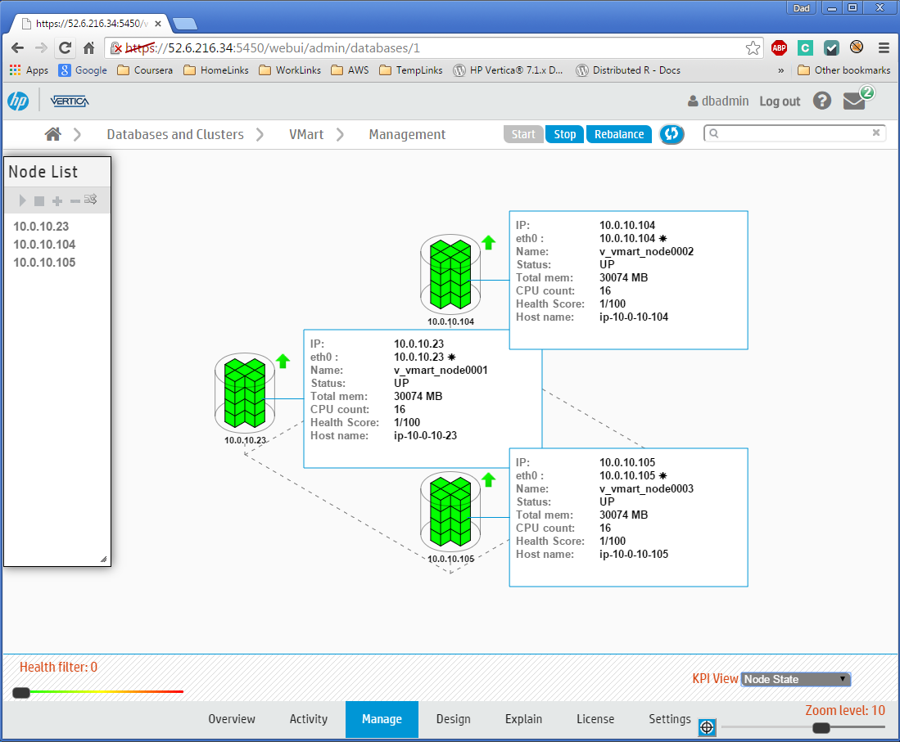
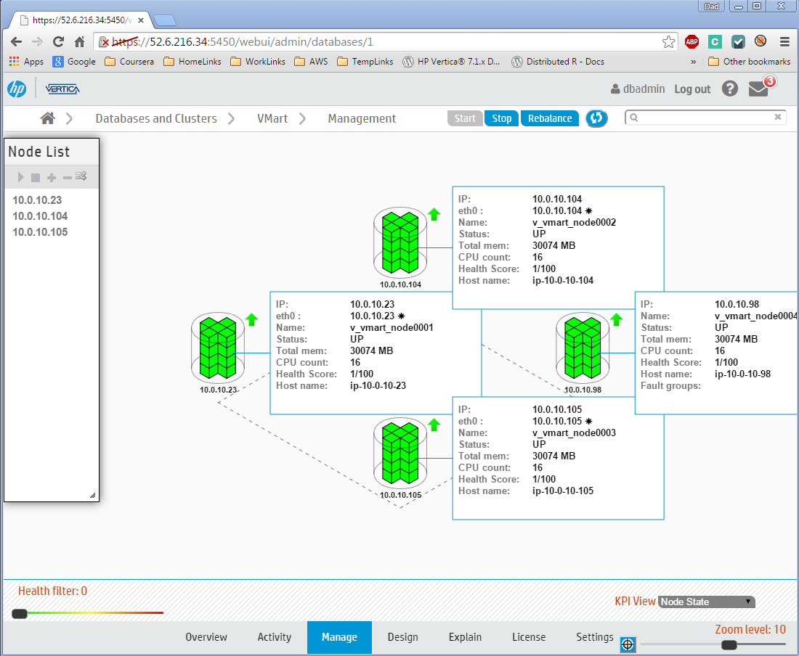
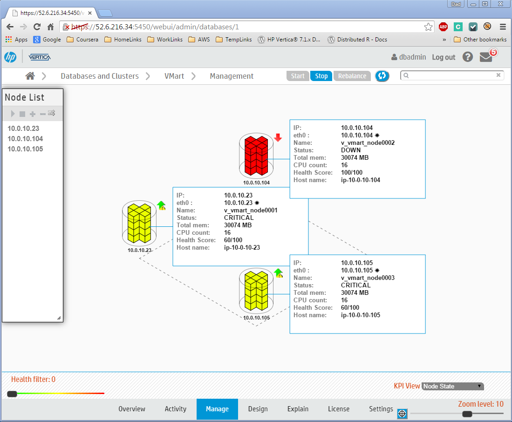

#Automatic Vertica Scaling and Node Replacement on AWS

If you are using AWS (or are considering using AWS) to host your Vertica cluster, then you may wonder if the AWS Auto Scaling service will work with a Vertica cluster. Well, wonder no more - the answer is 'yes'.

Our new AWS Vertica Autoscaling package makes the setup easy. Here are some of its features:
- Provision a new Vertica cluster with the number of nodes you want
- Add horsepower by making your cluster bigger
- Save money by making your cluster smaller
- Keep your cluster resilient by automatically replacing failed nodes with new nodes (no need to pay for active standby nodes)
- Subscribe to receive notifications when nodes are added or removed

The Vertica auto scaling package is provided to you free of charge (and also free of any warranty or liability). If you like it you can use it as it is, or you can make it better, and contribute it back to the Vertica community.  

As you read through the sections below, you will learn how it all works, and you'll be able to try it for yourself.

Ready to get started?

## Setup

- **Download the Vertica Auto Scaling package from github**  
`git clone https://github.com/rstrahan/aws-autoscaling-vertica.git`

- **Create the config file**  
Copy the template, `autoscaling_vars.sh.template`, to `autoscaling_vars.sh`, and edit to provide valid settings for each variable. See Appendix B for details.  
When you are done editing, check the configuration with `./validate_config.sh`

- **Make the instance userdata launch script**  
Run `./makeLaunchScript.sh` to create `launch.sh` from the template and the config settings entered in the previous step.
The launch.sh script will be run by each new EC2 instance on its first startup.

- **Install and configure the AWS client**  
Run `./installAWSClient.sh` to download, install, and configure the AWS command line interface using the AWS account information you put in autoscaling_vars.sh.

## Auto Scaling in Action

### 1. Create a new Vertica cluster from scratch

Three simple steps:
```
# create autoscaling group with 1 instance
./setup_autoscaling.sh

# install Vertica 1-node cluster and set up database
./bootstrap.sh

# expand cluster to desired size (per config file)
./scale_cluster.sh
```
After a few minutes your cluster will be ready. Now you can create users, hook up your application, load your data, & import cluster to Vertica Management Console.

To list the public and private IP addresses for each node in your cluster, use the handy `cluster_ip_addresses.sh` script.

Connect using ssh as dbadmin user to the public address of any node using your certificate (pem) file: `ssh -i <pem> dbadmin@<publicIp>`. Once securely logged in to any cluster node you can connect locally to the database as dbadmin, without a password.

You can also connect to the database from outside the cluster using vsql or one of the supported client libraries. E.g. `vsql -h <publicIp> -U dbadmin -w <password>`.

Here's the Management Console view of our new 3-node cluster.



###2. Make your cluster bigger

Edit the autoscaling_vars.sh file, and change the setting `desired` to a larger number (not greater than `max`).  
Then run `./scale_cluster.sh` to configure the new setting, and see your cluster grow!
```
$ ./scale_cluster.sh
Configuring Autoscaling Group: BobsAutoscalingCluster1
Setting
 - min instances:       3
 - max instances:       9
 - desired instances:   4
Done
```

You can query the table `autoscale.launches` to see the updating status as the new instances are added to the cluster, and then to the database.

Management Console will automatically detect and add the additional node(s) to its cluster/database view.




###3. Make your cluster smaller

Edit the autoscaling_vars.sh file, and change the setting `desired` to a smaller number (not smaller than `min`). Then run `./scale_cluster.sh` to configure the new group setting.

```
$ ./scale_cluster.sh
Configuring Autoscaling Group: BobsAutoscalingCluster1
Setting
 - min instances:       3
 - max instances:       9
 - desired instances:   3
Done
```
You can query the table `autoscale.terminations` to see the updating status as the instances are removed from the database, and then from the cluster.

Management Console will automatically remove the terminated node(s) from its cluster/database view. Now the database looks just like it did when we started, with 3 nodes again.


###4. Replace a DOWN node

A DOWN node will be automatically terminated after a configurable timeout period, and  replaced by a new node which will be configured to adopt the privateIP address of the old one.

Here, we see a failed node highlighted DOWN in MC, with the remaining 2 nodes marked CRITICAL. Auto scaling will automatically terminate the DOWN node after 5 minutes (default) and replace it with a new node to take its place.



After the timeout has elaspsed (in this case 5 minutes), the AWS EC2 instance for the DOWN node will be terminated. This action is logged in the table `autoscale.downNodes`

The Auto Scaleing service will launch a new instance to restore the cluster to the desired node count. You can query the table `autoscale.launches` to see the updating status as the new instance is added to replace the failed one.

When it has finished, the cluster is restored again to perfect health.


## APPENDIX - Config File

- Create config File: autoscaling_vars.sh

Copying the template provided, and edit to provide valid settings for each variable. See Appendix for more detail.

The configuration file expects you to provide names and paths to some existing AWS artifacts:
- You account AWS Access Key ID, Secret Key
- An AWS EC2 key pair and associated certificate file (.pem)
- A VPC Subnet to use for your cluster
- A Security Group for AWS to apply to your new cluster nodes.

If you don't have any of these, don't panic! Instead, use the AWS console to create them. It's easy - there are no special requirements - just make sure that you use a VPC subnet that has plenty of addresses to accommodate the maximum number of nodes you will ever have in your cluster, and that you use a security group that is permissive, or that at least won't prevent Vertica from working (see [Vertica Doc - Firewall Considerations](http://my.vertica.com/docs/7.1.x/HTML/index.htm#Authoring/InstallationGuide/BeforeYouInstall/EnsurePortsAreAvailable.htm)).

If you are planning for your Vertica cluster to have more than 3 nodes (which seem likely if you are interested in autoscaling!), then you'll also need a Vertica license, because the free built-in Community Edition (CE) license is limited to 3 nodes. You can use the CE license if you want to experiment with scaling between 1 and 3 nodes (KSafety 0), or to maintain a 3-node cluster using auto scaling only to provide resilience.

Everything else will be created for you, including:
- Placement group (best network throughput between nodes)
- Auto Scaling Launch Configuration
- Auto Scaling Group (controls the cluster)
- SQS Queue (used to inform cluster of impending node removal)
- SNS Topic (for notification subscriptions - email / text / other)
- Vertica cluster
- Vertica Database

When you are done editing the config script, check it with the validation script: `./validate_config.sh`


# TODO

- Usage triggers for scaling
- Schedule trigger for scaling
- Test at scale - best scaling factor, rebalance time, etc.
- Placement Group problems: (should PG be optional?)
Description: Launching a new EC2 instance.  Status Reason: We currently do not have sufficient capacity to launch all of the additional requested instances into Placement Group 'BobsPlacementGroup'.  You may be able to satisfy your full cluster requirement by first terminating all of the existing instances in Placement Group 'BobsPlacementGroup' then launching the full cluster of required instances into Placement Group 'BobsPlacementGroup' in a single launch request. Launching EC2 instance failed.
- configuration in DB tables instead of file.. make config dynamic
NEXT
- ELB
- auto DR cluster?

